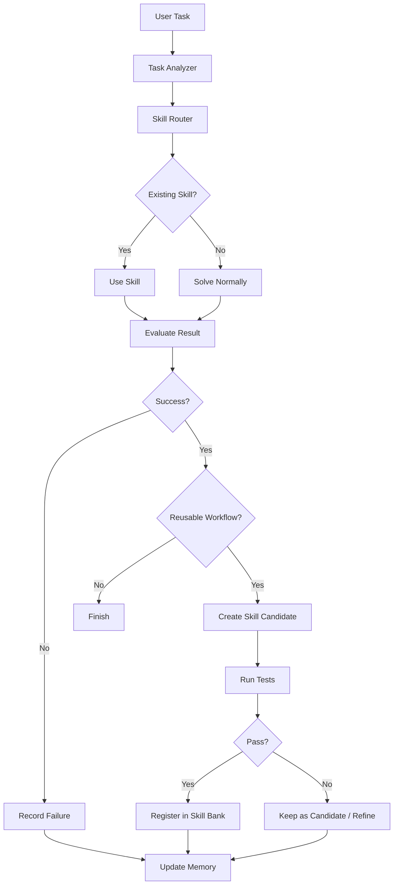

# MUSE Architecture

## 目的

MUSE は、エージェントがタスクを実行しながら再利用可能な Skill を発見・作成・評価・改善するためのアーキテクチャである。

基本方針は、LLM の自己評価だけに頼らず、テスト、実行結果、出力検証、副作用確認、タスク単位の受け入れ条件で成功/失敗を判定すること。

## 基本フロー



## コンポーネント

### Task Analyzer

ユーザーの依頼から、目的、入力、出力、副作用、成功条件を抽出する。

出力例:

```yaml
task_id: outlook_to_slack_daily_summary
goal: 明日のOutlook予定をSlackへ通知する
inputs:
  - target_date
  - calendar_account
outputs:
  - slack_message
side_effects:
  - slack_post
success_criteria:
  - 対象日はJST基準である
  - 件名、開始時刻、終了時刻を含む
  - 予定が0件の場合は「予定なし」と通知する
```

### Skill Router

既存 Skill を検索し、タスクに使える Skill または Skill の組み合わせを選ぶ。

優先順位:

1. `.codex/skills/` にある本番利用可能な Skill
2. `.muse/candidates/` にある検証中 Skill
3. `.muse/quarantine/` にある外部由来 Skill
4. Web や公式ドキュメントなどの参考情報

### Skill Bank

テスト済みで再利用可能な Skill を保存する領域。

推奨構成:

```text
.codex/
  skills/
    graph-calendar/
      SKILL.md
      eval.yaml
      .memory.md
      scripts/
      tests/
      usage.jsonl

.muse/
  candidates/
    n8n-outlook-to-sheets/
  quarantine/
    imported-skill-001/
  evaluations/
  logs/
```

### Skill Candidate Builder

タスク成功後、再利用価値がある作業を Skill 候補に変換する。

Skill 化する条件:

1. 今後も繰り返される可能性がある
2. 手順が3ステップ以上ある
3. 入力と出力が明確である
4. テストまたは検証コードで成功判定できる
5. 秘密情報や credential を含まない
6. 既存 Skill と重複しない

Skill 化しない条件:

1. 1回限りの作業
2. ユーザー固有すぎる作業
3. 成功条件が曖昧
4. テスト不能
5. 秘密情報を含む
6. 外部副作用が大きく承認なしでは危険

### Evaluator

Skill またはタスク実行結果を評価する。

評価レイヤー:

1. Runtime 判定: exit code、例外、timeout、出力ファイル有無
2. Unit Test 判定: schema、変換処理、既知ケース
3. Integration Test 判定: API 応答、外部サービス接続、dry-run
4. Task-level 判定: ユーザー目的と acceptance criteria
5. LLM Judge: 読みやすさ、自然さ、意図への整合性
6. Human Approval: 本番送信、書き込み、デプロイ、決済など

## 成功判定

成功/失敗は `usage.jsonl` に JSON Lines 形式で記録する。

成功例:

```json
{"timestamp":"2026-06-05T00:00:00+09:00","skill":"graph-calendar","task":"outlook_to_slack","status":"success","score":0.95,"checks":{"exit_code":true,"schema":true,"api":true,"task_goal":true}}
```

失敗例:

```json
{"timestamp":"2026-06-05T00:05:00+09:00","skill":"graph-calendar","task":"outlook_to_slack","status":"failure","score":0.45,"checks":{"exit_code":true,"schema":true,"api":false,"task_goal":false},"error_type":"permission_error","message":"Graph API returned 403"}
```

スコア基準:

| Score | Status | 意味 |
| --- | --- | --- |
| 0.0 | failed | 実行できない |
| 0.2 | failed | 実行はできたが出力が壊れている |
| 0.5 | failed | 出力形式は正しいが内容が違う |
| 0.8 | needs_refinement | 概ね正しいが一部欠落 |
| 0.9+ | reusable | 再利用可能 |

## eval.yaml

各 Skill は `eval.yaml` を持つ。

```yaml
skill: graph-calendar
success_threshold: 0.9

checks:
  - name: command_exit_code
    type: runtime
    required: true

  - name: output_json_schema
    type: schema
    file: tmp/events.json
    required: true

  - name: timezone_is_jst
    type: custom
    command: python tests/check_timezone.py
    required: true

  - name: has_required_fields
    type: pytest
    command: python -m pytest .codex/skills/graph-calendar/tests
    required: true

failure_policy:
  on_required_check_failed: failure
  on_optional_check_failed: needs_refinement
```

## 失敗分類

| Error Type | 意味 | 次の処理 |
| --- | --- | --- |
| runtime_error | 実行時エラー | script 修正 |
| schema_error | 出力形式違反 | parser/schema 修正 |
| wrong_answer | 内容が違う | 手順または prompt 修正 |
| permission_error | 権限不足 | 認可・設定確認 |
| network_error | 外部通信失敗 | retry または隔離 |
| side_effect_error | 書き込み/送信失敗 | dry-run と承認確認 |
| ambiguous_goal | 成功条件が曖昧 | acceptance criteria 追加 |
| flaky | 成功が不安定 | 安定化または隔離 |

失敗内容は `.memory.md` に蓄積し、次回以降の Skill 利用時に参照する。

## 外部 Skill の扱い

外部 Skill、プラグインマーケット、GitHub リポジトリ、Web snippets は、直接 `.codex/skills/` に入れない。

取り込み手順:

1. `.muse/quarantine/` に配置する
2. `SKILL.md` を静的レビューする
3. `scripts/`、hooks、MCP 設定、外部通信を確認する
4. secrets や環境変数の漏えいリスクを確認する
5. ライセンスを確認する
6. 必要な手順だけ抽出して自分の環境用に再パッケージする
7. `tests/` と `eval.yaml` を追加する
8. dry-run integration test を通す
9. 副作用がある Skill は人間承認後に登録する

Web 情報は Skill そのものではなく、Skill を作るための参考資料として扱う。

## Automation

Codex でタスク完了後の検証とログ記録を自動化する場合は、`.muse/tools/` の helper を使う。

代表的な処理:

```text
skill_router.py
  - 既存 Skill を検索する

evaluate_skill.py
  - eval.yaml に基づいて検証する
  - reusable / needs_refinement / failed を判定する

memory.py
  - usage.jsonl に追記する
  - deferred queue を記録する

skill_refiner.py
  - 必要なら .memory.md を更新する
```

注意: 本番送信、課金、デプロイ、権限変更を伴う処理は dry-run と human approval を必須にする。

## 運用レベル

### Level 1: 手動承認型

タスク完了後、エージェントが Skill 化候補を提案し、ユーザー承認後に作成する。

初期構築に向いている。

### Level 2: 半自動型

タスク成功後、エージェントが `.muse/candidates/` に Skill 候補と tests を作る。

登録前に人間が確認する。

推奨初期運用。

### Level 3: 自動型

タスク成功後、条件を満たす Skill を自動作成し、テスト通過後に Skill Bank へ登録する。

本番送信、課金、デプロイ、権限変更を伴う Skill は自動登録しない。

## 最小実装

最初に用意するもの:

```text
.muse/
  candidates/
  quarantine/
  evaluations/
  logs/

.muse/tools/
  evaluate_skill.py
  skill_router.py
  skill_policy.py
```

各 Skill に必ず用意するもの:

```text
SKILL.md
eval.yaml
tests/
usage.jsonl
.memory.md
```

評価コマンド例:

```bash
python .muse/tools/evaluate_skill.py graph-calendar
```

出力例:

```json
{
  "skill": "graph-calendar",
  "status": "success",
  "score": 0.95,
  "passed": [
    "command_exit_code",
    "output_json_schema",
    "timezone_is_jst"
  ],
  "failed": []
}
```

## セキュリティ原則

1. 外部 Skill を直接実行しない
2. credential、API key、token を Skill に保存しない
3. 本番送信や書き込みは dry-run を先に実行する
4. 副作用が大きい操作は human approval を必須にする
5. `scripts/` と hooks は必ずレビューする
6. Web 情報は公式ドキュメントを優先し、テストで検証する
7. Skill 登録はテスト通過後に限定する

## 参照元

- ChatGPT shared conversation: https://chatgpt.com/share/6a21a325-9428-83a3-8e81-bcbe82536a3d
