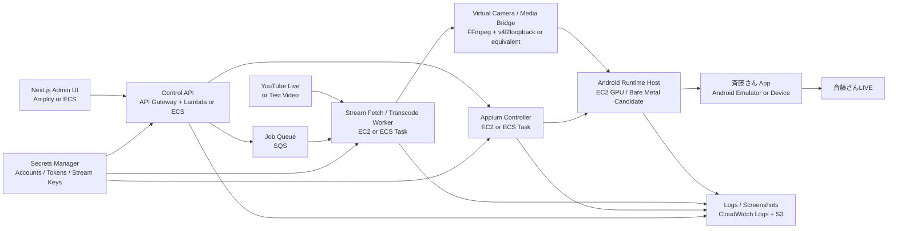
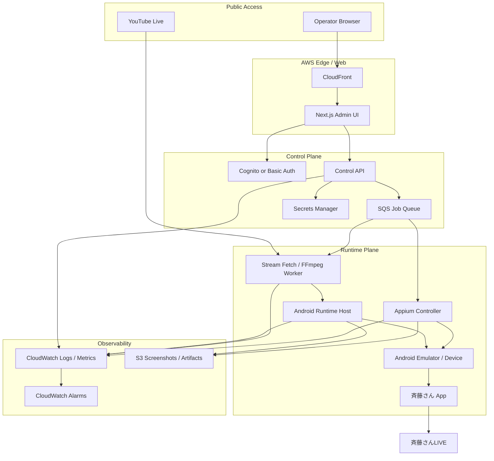

# AWS Architecture: YouTube to Saitousan LIVE Wrapper

ADR-0002の構想をAWS上で実現する場合の初期アーキテクチャ案。

## System Diagram

## AWS Component View

## Main Data Flows

| Flow | Path | Notes |
| --- | --- | --- |
| 配信映像入力 | YouTube Live -> Stream Worker -> Virtual Camera -> Android Runtime | 最初はYouTubeではなく固定動画で検証してよい |
| アプリ操作 | Admin UI -> Control API -> SQS -> Appium -> Android App | 配信開始/停止、ログイン確認、画面遷移を自動化 |
| 状態監視 | Runtime/Appium/Worker -> CloudWatch/S3 -> Admin UI | スクリーンショット、ログ、異常状態を保存 |
| 秘密情報 | Secrets Manager -> Control API/Appium/Worker | YouTube情報、アプリ認証情報、配信キーを直接コードに置かない |

## Suggested Phase 0/1 AWS Boundary

最初から全AWS化しない。Phase 0/1では、AWS構成図のうち次だけを検証対象にする。

- Android Runtime Host
- Appium Controller
- Stream Fetch / FFmpeg Worker
- Logs / Screenshots

Next.js Admin UI、API Gateway、SQS、Secrets Managerは、カメラ入力差し替えが成立してから導入する。

## Runtime Host Candidates

| Candidate | Pros | Cons | Use |
| --- | --- | --- | --- |
| EC2 Linux + Android Emulator | AWS内で完結しやすい | GPU/仮想化/カメラ入力が難しい | 第一候補だが要検証 |
| EC2 Windows + Android Emulator | GUI/デバッグしやすい | コストが高くなりやすい | 初期検証向き |
| EC2 Mac | Android Studio系の検証がしやすい可能性 | 高コスト、調達制約 | 必要時のみ |
| ローカル実機 + AWS Control Plane | アプリ互換性が高い | 完全クラウド化ではない | Emulatorが失敗した場合の代替 |

## Open Architecture Questions

- EC2上のAndroid Emulatorで斉藤さんアプリが起動するか。
- EC2上で仮想カメラ入力をAndroidアプリに渡せるか。
- 音声入力をどう扱うか。映像より難しい可能性がある。
- Appiumと配信ワーカーを同一ホストに置くか、分離するか。
- Runtime Hostを常時起動にするか、配信時だけ起動するか。
- CloudWatch/S3へ保存するスクリーンショットに個人情報が含まれないようにできるか。
